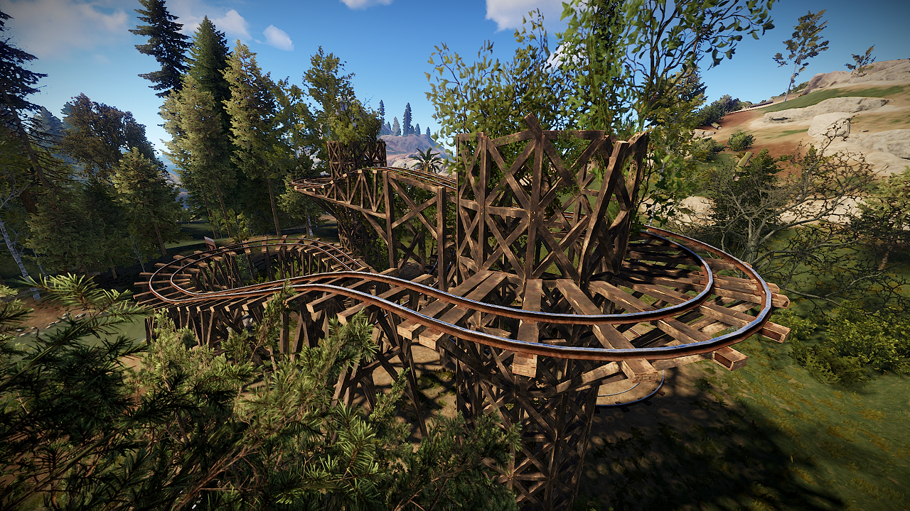
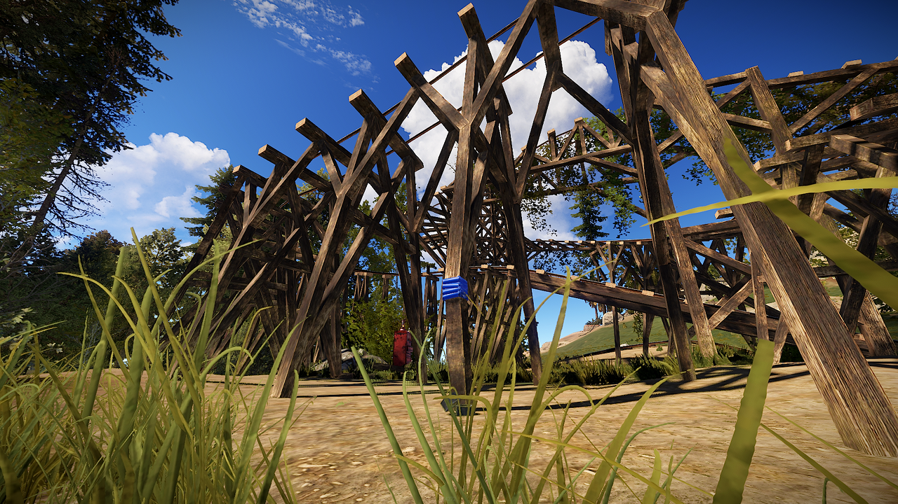
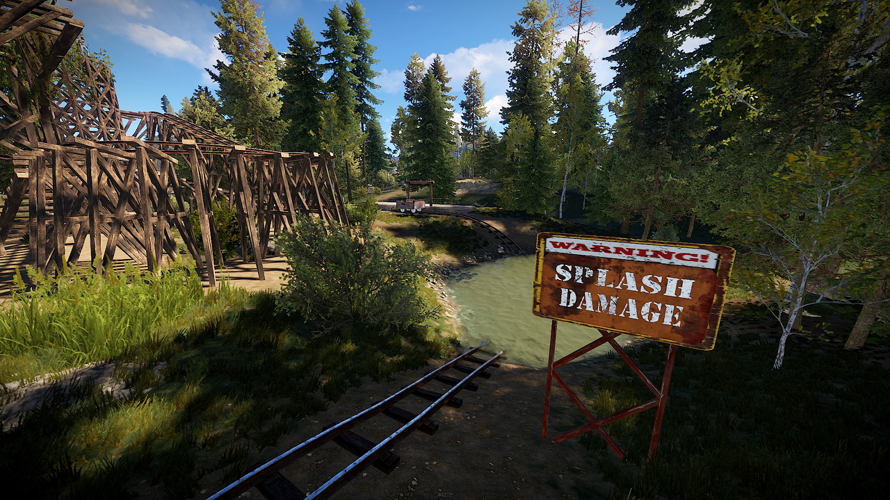
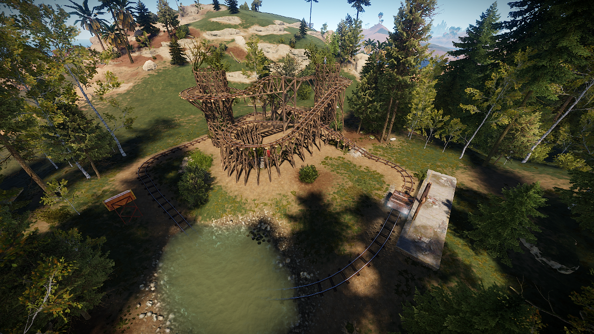

# Rust Rollercoster

Rust Rollercoaster is a custom prefab for the game [Rust](https://rust.facepunch.com/), to be used by creators of custom game maps. It comes with a walkable rollercoaster track including a water feature and a platform. It's meant to be used with the [Trains Plugin](https://www.chaoscode.io/resources/trains.162/) made by Colon Blow. It doesn't include any loot, npc spawns or a glowing ironsight.

## Usage

[Download the file prefab files](/yetzt/rust-rollercoaster/releases/latest/download/Rollercoaster.zip) and place them in the `RustEdit/CustomPrefabs` directory of [RustEdit](https://rustedit.io/). The prefab can then be accessed in the custom section of the prefab browser. Don't forget to apply *Height*, *Topology* and *Splat* masks and break the prefab before you save the map to be used on your server. 

## Screenshots

## License

This work can be used, modified and distributed under the terms of the
[Creative Commons Attribution 4.0](https://creativecommons.org/licenses/by/4.0/) license. Attribution is very much appreciated.
